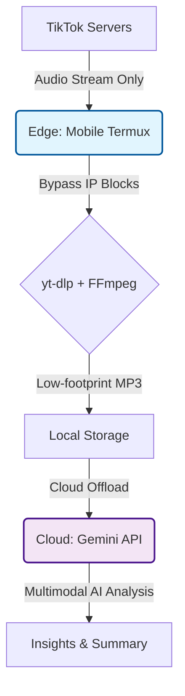

## 📖 The Origin Story: Why was this built?

הכל התחיל מצורך אישי יומיומי. כולנו צורכים כיום תוכן דרך סרטונים קצרים (TikTok, Reels), אבל הפלטפורמות האלה הן חרב פיפיות: מצד אחד, יש שם תוכן שאפשר ללמוד ממנו המון. מצד שני, הרשת מוצפת במידע שגוי (Misinformation / "חירטוטים"). 

הגבול בין תוכן איכותי לפייק-ניוז הוא דק, והרבה פעמים מצאתי את עצמי רוצה פשוט **לקחת את הסרטון, לזרוק אותו ל-Gemini, ולהתייעץ איתו:** "האם מה שנאמר כאן נכון?", "תסכם לי את הטיעונים", או "בוא נבחן את המידע הזה ביחד".


**למה לא פשוט להוריד את הסרטון ידנית? (The Naive Approach)**
הפתרון המיידי (והפחות חכם) היה להוריד את הסרטון למכשיר ולשלוח ל-AI, אבל הגישה הזו יצרה בעיות חדשות:
1. **Gallery Clutter (זיהום הגלריה):** כל הורדה נשמרת אוטומטית בגלריית התמונות הפרטית. זה מייצר המון "זבל דיגיטלי" שצריך למחוק ידנית אחר כך.
2. **Storage & Bandwidth Bloat:** סרטוני וידאו שוקלים עשרות מגה-בייטים, מה שגוזל שטח אחסון, מאט את העלאה לענן ומבזבז חבילת גלישה.
3. **AI Payload Inefficiency:** כדי להבין ולסכם טיעון, ה-AI לא באמת צריך "לראות" את הווידאו. שליחת הפיקסלים והוויזואליה היא מטען עודף (Overhead) מיותר לחלוטין כשהמידע האמיתי נמצא בסאונד.

**כאן התחיל האתגר ההנדסי:**
איך מעבירים ל-AI *רק* את המידע שהוא באמת צריך (אודיו), בלי לזהם את המכשיר, בלי להשתמש בבוטים חיצוניים שנחסמים תדיר (Anti-Bot), ובלי לקרוס תחת מגבלות החומרה של המובייל?
רעיון זה בה במטרה ברורה לעשות את המעבר בין אפליקציית טיקטוק להתייעצות עליה עם הצאט גם בצורה הטובה ביותר וגם המהירה ביותר , והכל דרך הטלפון שבו אנו משתמשים כדי לרות סרטונים אלו .
הבנתי שהפתרון לא יהיה "לכתוב עוד קוד", אלא למצוא את הארכיטקטורה הנכונה (Edge + Cloud) שתחבר בין המכשיר שלי לענן בצורה חלקה, אלגנטית ומינימליסטית. 
--

# 🏗 System Architecture: Edge-Aware Hybrid Pipeline

המערכת בנויה בגישת **Edge-Awareness**:
חלוקה מודעת של עומסים בין מכשיר הקצה (הטלפון) לענן.

העיקרון:

* המובייל מטפל רק במה שחייב להיות מקומי (גישה ל-Residential IP + חילוץ אודיו).
* הענן מטפל רק במה שכבד חישובית (AI multimodal analysis).

---

## Mermaid Diagram (GitHub renders automatically)



---

# ⚖️ Architectural Comparison

במהלך הפיתוח נבחנו שלוש גישות:

| Approach                          | Network Reliability     | Resource Cost | Conclusion                      |
| --------------------------------- | ----------------------- | ------------- | ------------------------------- |
| **1. Cloud Scraper Bot**          | ❌ נמוכה (Cloud IP נחסם) | ✅ נמוכה       | נפסל עקב 403 / Rate Limits      |
| **2. Full Local AI (Whisper)**    | ✅ גבוהה                 | ❌ גבוהה מאוד  | נפסל עקב עומס CPU, חימום וסוללה |
| **3. Edge-Aware Hybrid (Chosen)** | ✅ גבוהה                 | ✅ נמוכה       | האיזון האופטימלי                |

הלקח:
לא צריך לבחור בין Edge לבין Cloud — צריך לשלב ביניהם חכם.

---

# ⚠️ Hardware Constraints Management (Mobile)

המערכת נבנתה תוך התחשבות מלאה במגבלות חומרה (Samsung S24):

### CPU & Battery

הרצת מודל תמלול מקומי (כגון Whisper) גורמת ל:

* חימום יתר
* Thermal Throttling
* Drain משמעותי לסוללה

לכן מבוצע Compute Offloading לענן.

---

### RAM & Storage

וידאו צורך נפח עצום.
הפתרון:

* חילוץ **Audio בלבד**
* שמירה בשם קבוע
* דריסה בכל הרצה

תוצאה:
אין הצטברות קבצים. אין בלאגן. אין זליגת אחסון.

---

# ⏱ Performance Benchmarks

### Audio vs Video Extraction

ההחלטה הקריטית הייתה להוריד `bestaudio` בלבד.

| Metric                      | Full Video (1080p) | Audio Only (192kbps) | Improvement |
| --------------------------- | ------------------ | -------------------- | ----------- |
| File Size (1 min)           | 15–30 MB           | 1.5–2.5 MB           | ~90% פחות   |
| Download Time (Mobile Data) | 10–20 sec          | 1–3 sec              | מהיר פי כמה |
| Storage Impact              | גבוה               | זניח                 | אין הצטברות |

הורדת וידאו הייתה בזבוז משאבים.
אודיו בלבד הופך את המערכת למיידית.

---

# 🔄 Evolution of the Solution

## ניסיון ראשון — Cloud Bots (נכשל)

* שימוש בבוטים / Scrapers ציבוריים
* חסימות IP מיידיות
* 403 Forbidden

TikTok מזהה טווחי IP של שרתי ענן.

---

## ניסיון שני — Full Local AI (נכשל)

* הורדה מלאה
* תמלול Whisper מקומי
* קריסות
* תלות כבדה (numba וכו')
* Drain סוללה קיצוני

Over-Engineering קלאסי.

---

## הפתרון — Edge Extraction + Cloud AI

### למה Termux?

המכשיר משתמש ב-Residential IP →
נראה כמו משתמש רגיל → לא נחסם.

---

### למה רק Audio?

* קטן פי ~10
* מהיר
* חסכוני בדאטה

---

### למה Gemini?

מודל Multimodal.
מקבל MP3 ישירות →
מבצע ניתוח וסיכום ללא שלב תמלול ביניים.

---

### למה דריסת קובץ?

נשמר תמיד כ:

```
/sdcard/Download/tiktok_audio.mp3
```

בכל הרצה — הקובץ הקודם נמחק.
אין בלאגן בזיכרון.

---
## 🚀 Installation (Android + Termux)

כדי להריץ את הפרויקט על מכשיר Android:

1. התקן **Termux** דרך F-Droid (לא דרך Google Play):  
   https://f-droid.org/en/packages/com.termux/

2. פתח את Termux והרץ:

   ```bash
   pkg update && pkg upgrade -y
   pkg install python ffmpeg -y
   pip install yt-dlp
   termux-setup-storage
צור קובץ בשם get.py והדבק לתוכו את הקוד מה-README.

לאחר מכן ניתן להריץ עם:

python get.py

# ⚙️ User Flow (End-to-End)

### Step 1 — Input

העתקת קישור מ-TikTok.

### Step 2 — Extraction

ב-Termux:

```bash
python get.py
```

הדבקת הקישור.
המערכת מורידה וממירה לאודיו.

### Step 3 — AI Analysis

העלאת הקובץ ל-Gemini →
בקשת סיכום →
קבלת תובנות בעברית.

כל התהליך: שניות.

---

# 💻 Core Logic (get.py)

```python
import yt_dlp

url = input("Paste TikTok link: ")

ydl_opts = {
    'format': 'bestaudio/best',
    'outtmpl': '/sdcard/Download/tiktok_audio',
    'postprocessors': [{
        'key': 'FFmpegExtractAudio',
        'preferredcodec': 'mp3',
        'preferredquality': '192',
    }],
}

try:
    with yt_dlp.YoutubeDL(ydl_opts) as ydl:
        ydl.download([url])
    print("\n✅ Success! File is in your Downloads folder.")
except Exception as e:
    print(f"\n❌ Error: {e}")
```

---
🔄 עדכון v2.0: גשר האוטומציה ל-Google Drive (למי שלא מצליח להעלות ידנית)
אם אתם נתקלים בקשיים בהעלאת קובץ ה-MP3 ישירות מהמכשיר לממשק ה-AI (עקב הגדרות דפדפן או קושי באיתור הקובץ בתיקיות האנדרואיד), ניתן להשתמש ב"גשר" שבנינו באמצעות rclone.

במקום לחפש את הקובץ ולהעלות אותו ידנית, האוטומציה הזו תשלח את האודיו ישירות לתיקייה ייעודית ב-Google Drive שלכם מיד בסיום ההורדה. כך תוכלו פשוט לשתף את הקישור מהענן עם ה-AI במינימום חיכוך.

איך להפעיל את האוטומציה?

התקינו את rclone ב-Termux: pkg install rclone

הגדירו חיבור לדרייב: הרצו rclone config (צרו Remote חדש בשם Google Drive).

השתמשו בקוד המעודכן ב-get.py:

Python
import os

url = input("Paste TikTok link: ")
file_path = "/sdcard/Download/tiktok_audio.mp3"

# מחיקת קובץ ישן למניעת כפילויות
if os.path.exists(file_path):
    os.remove(file_path)

print("⏬ Downloading...")
os.system(f'yt-dlp --force-overwrites -x --audio-format mp3 -o "/sdcard/Download/tiktok_audio.%(ext)s" "{url}"')

print("☁️ Uploading to Google Drive Bridge...")
# שליחה אוטומטית לתיקייה בדרייב
os.system(f'rclone copy "{file_path}" "Google Drive:TikTok_Downloads"')

print("✅ Success! The file is waiting for you in Google Drive.")


סרטון הדרכה קיים אצלי על פי בקשה 


# 🧠 Key Engineering Insight

האתגר לא היה קוד מורכב.
האתגר היה ארכיטקטורה.

הניסיון לדחוף הכל למובייל נכשל.
הניסיון לדחוף הכל לענן נחסם.

הפתרון היה להבין:

* Edge פותר חסימות.
* Cloud פותר עומס חישובי.
* Audio בלבד פותר ביצועים.
* דריסת קבצים פותרת תחזוקה.

Minimal surface area.
Maximum leverage.

---

# 🎯 Final Outcome

מערכת:

* יציבה
* מהירה
* חסכונית במשאבים
* חסינה מחסימות IP
* מותאמת מובייל אמיתי

לא Over-Engineered.
לא תלויה בשרתים חיצוניים.
לא צורכת GPU.

פשוט ארכיטקטורה נכונה.
